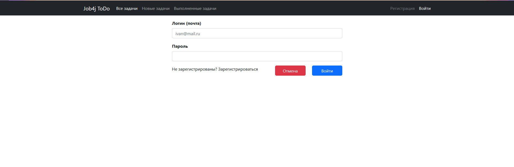

### Job4j_todo

#### Описание проекта:
Данный проект является web-списком задач.
Приложение включает в себя следующий функционал:
- отображение всех задач,
- возможность отображать только выполненные или только новые задачи,
- возможность просматривать подробное описание задач,
- возможность редактировать задачу, менять статус задачи на "выполнено", а также удалять задачу

#### Стек технологий:
Spring boot, Thymeleaf, Bootstrap, Hibernate, PostgreSql

#### Минимальные требования к окружению:
Для запуска приложения необходимы Java 17, PostgreSQL 14, Maven 3.8

#### Запуск проекта:
Перед запуском приложения необходимо создать базу данных todo в PostgreSQL 14
с помощью команды ```create database todo```
после чего необходимо запустить скрипт из папки C:\projects\job4j_todo\db\scripts.
Затем необходимо открыть класс C:\projects\job4j_todo\src\main\java\ru\job4j\todo\Main.java и запустить приложение.

#### Взаимодействие с приложением:
При открытии сайта запускается страница со всеми задачами:


При переходе на вкладку "Новые задачи" откроется список только с задачами, которые сейчас в работе (новые):


По аналогии с предыдущим пунктом, при переходе на вкладку "Выполненные задачи" откроется список выполненных задач:


Для добавления задачи нужно нажать на синюю кнопку с надписью "Добавить задачу".
При нажатии на эту кнопку открывается страница с полем, в которое нужно внести название задачи.
Для сохранения задачи в списке необходимо нажать на кнопку с надписью "Добавить задачу".
Статус добавленной задачи будет по умолчанию присвоен как "в работе" (новая).
При нажатии на кнопку с надписью "Отмена" задача не сохранится и будет осуществлен переход на страницу со всеми задачами.


Для редактирования названия/изменения статуса или удаления задачи необходимо нажать на название задачи.
Будет осуществлен переход на страницу с задачей.
На странице с задачей 3 кнопки:
1. "Завершить" или "Взять в работу"
2. Удалить
3. Редактировать


Название первой кнопки зависит от первоначального статуса задачи: 
- если задача имеет статус "В работе" (новая), то надпись на первой кнопке будет "Завершить":


- если задача имеет статус "Выполненная", то надпись на первой кнопке будет "Взять в работу" 


При нажатии на данную кнопку меняется статус задачи (с "В работе" на "Выполненная" и с "Выполненная" на "В работе").
После чего осуществляется автоматический переход на страницу со всеми задачами.


При нажатии на кнопку с надписью "Удалить", осуществляется удаление задачи автоматический переход на страницу со всеми задачами.

После нажатия произошло удаление и удаленная задача больше не отображается в списке задач


Для изменения имени необходимо ввести новое имя в графе "Наименование задачи", после чего нажать на кнопку с надписью "Редактировать".
После данных действий будет осуществлен автоматический переход на страницу со всеми задачами, где отредактированная задача будет
отображаться с новым именем:

Вводим новое название и кликаем на кнопку "Редактировать"

После нажатия произошло редактирование названия и обновленная задача отображается в списке задач с новым названием:


#### Контакты
При возникновении вопросов, обращайтесь в телеграм: https://t.me/relaxedlife05
